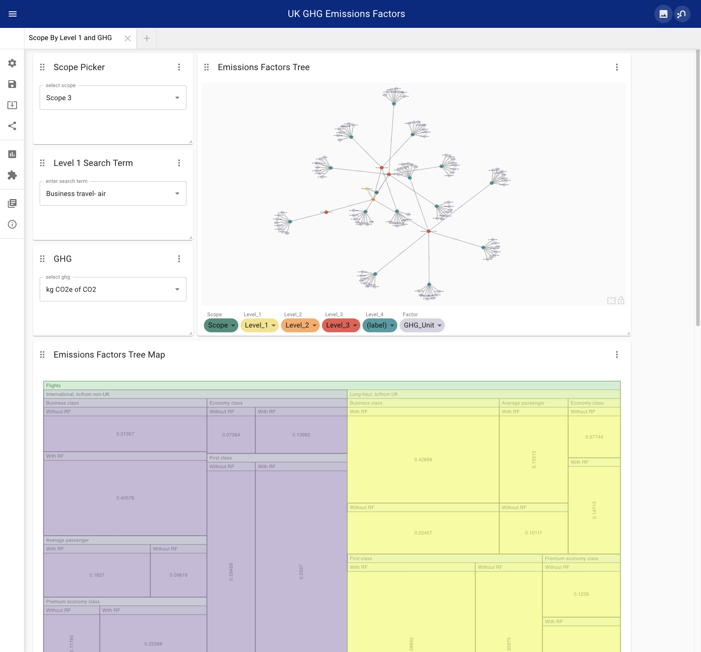

# neo4j-ghg-emission-factors

Neo4j graph database and NeoDash dashboard of GHG emission factors for Scope 1,2,3 compliance reporting compiled by the [UK government](https://www.gov.uk/government/publications/greenhouse-gas-reporting-conversion-factors-2022)

Contains 8037 individual factors organized in directed hierarchical graphs for each Scope.

### Install:

Create a Neo4j version 5 or greater database with APOC utilities plugin installed

Copy the data/ghg-conversion-factors-2022-flat-format.csv to your Neo4j import folder

Run the load queries in `load-ghg-efs.cyp`

Launch NeoDash from the Neo4j Desktop Apps sidebar (you may need to install it from the App Gallery)

Import `dashboard.json` into NeoDash

You'll get something that looks like this:

image.png
